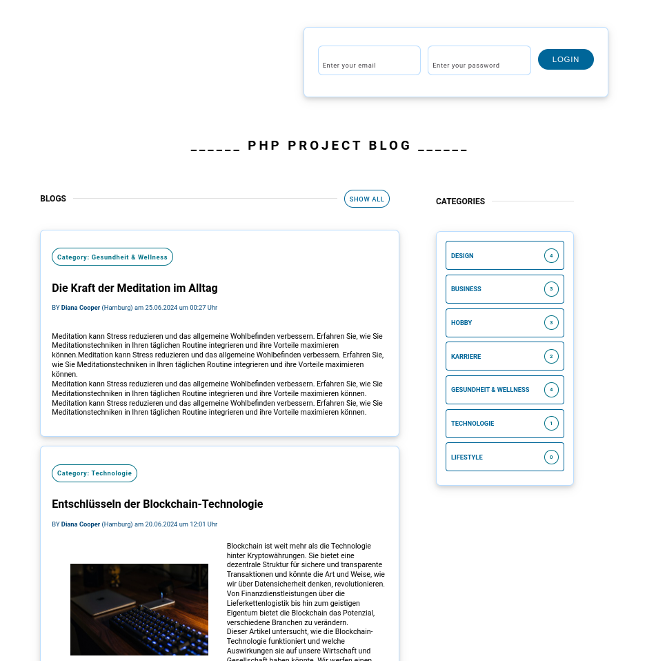
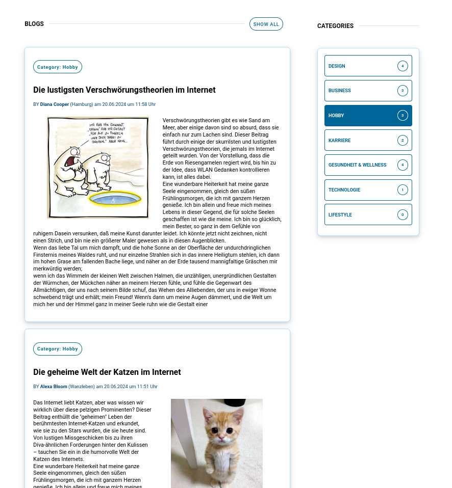
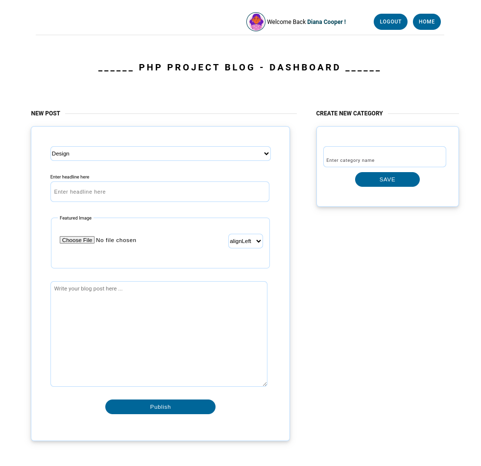

# My Blog Project

This project is a web-based blog website, developed as part of a PHP course. It features user authentication, blog post creation and management, and categorization of posts.

## Description

The application allows users to log in, compose, and publish blog posts, add categories, and filter posts by these categories. It also offers the capability to view all published posts, supported by a secure and intuitive user interface.

## Key Features

- **User Registration and Login**: Secure access for users.
- **Blog Post Creation and Management**: Users can write new posts and edit existing ones.
- **Category Management**: Users can create new categories to organize their posts.
- **Post Filtering**: Posts can be filtered by categories.
- **Viewing All Posts**: A summary page displays all posts.

## Directory Structure and Important Files

- **`/include/`**: Contains PHP inclusion files for functions and configurations.
  - **`config.inc.php`**: Basic configuration settings.
  - **`dateTime.inc.php`**: Functions for date and time formatting.
  - **`db.inc.php`**: Functions for database interactions.
  - **`form.inc.php`**: Functions for creating and processing forms.

- **`/css/`**: Contains all CSS files for the application's design.
  - **`main.css`**: Defines the basic styles of the application.
  - **`debug.css`**: Specifically developed for debugging styles.

- **`/_sql/`**: SQL backup files for the database structure.

- **`/uploads/`**: Stores and manages user uploads of images.

- **`index.php`**: The homepage of the application, serving as the entry point.

- **`dashboard.php`**: A special dashboard page that offers additional data visualization and interaction capabilities.

## Using the `uploads` Folder

- **Purpose**: The `/uploads/` folder is designated for storing and managing images uploaded by users.
- **Image Handling**: Images are automatically renamed upon upload to ensure uniqueness and stored in this folder, which helps to avoid file name collisions and maintain organization.
- **Security Measures**: Access to the `/uploads/` folder should be restricted to prevent unauthorized access. Ensure proper server configuration to limit exposure of sensitive content.

## Using the SQL Backup

- **Purpose**: The `/_sql/` directory contains SQL backup files essential for setting up the database structure needed for the application.
- **Database Setup**:
  1. Ensure that MariaDB or a compatible database server is installed and running.
  2. Create a new database for your application.
  3. Import the `blogprojekt.sql` file into your newly created database.

## Technologies

- **PHP**: For server-side logic.
- **CSS**: `main.css` and `debug.css` for styling.
- **SQL**: Uses MariaDB for data management.

## Installation

1. Clone the repository to your server.
2. Import the SQL backup file `blogprojekt.sql` into your MariaDB database.
3. Configure the database connections in `config.inc.php`.
4. Start the application by accessing `index.php` in your web browser.

## Security Features

- Validation and sanitization of user inputs.
- Secure handling of user sessions.
- Protection of important files and directories through server configurations.

## Contributing

Interested developers are welcome to contribute to the project by forking it, making changes, and submitting pull requests.

## License

This project is released under the MIT License. Further details can be found in the attached license file.

## Screenshots

## Video

[![Download or View Video]](media/video/blog-website-overview.gif)
[![Download or View Video]](media/video/blog-website-overview.mp4)
